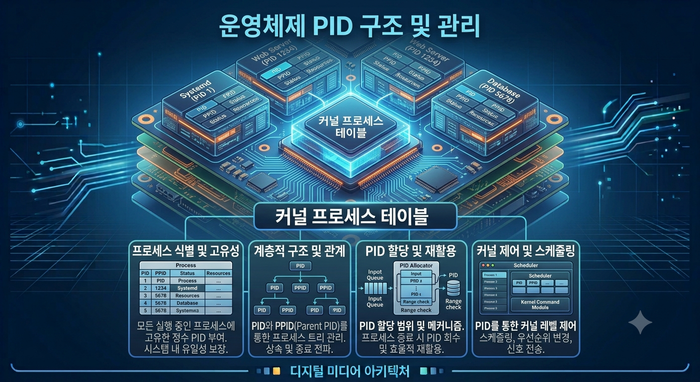

# [PCB](PCB(ProcessControlBlock).md)- Process Id

각 프로세스를 유일하게 구별하기 위해 부여하는 고유한 정수 번호

</image>

## 특징

- PCB내 존재 : PCB 내에 포함되어 관리됨, OS가 프로세스를 제어할 때 기본 키 역할을 수행함
- PID 1번 : 시스템 부팅 시 가장 먼저 생성되는 최초의 사용자 공간 프로세스가 통상 PID 1번을 할당 받음,
다른 모든 프로세스의 최상위 부모가 됨
- 재사용 문제 : 프로세스가 종료되면 PID는 회수되어 향후 새로 생성되는  프로세스에 재할당 될 수 있음

## 좀비 프로세스 문제

자식 프로세스는 종료됐지만 부모 프로세스가 Wait 시스템을 콜을 호출하여 자식의 종료 상태를 읽어가기 
전까지, 커널은 해당 자식의 PID와 PCB 최소 정보를 메모리에 남겨두는 것